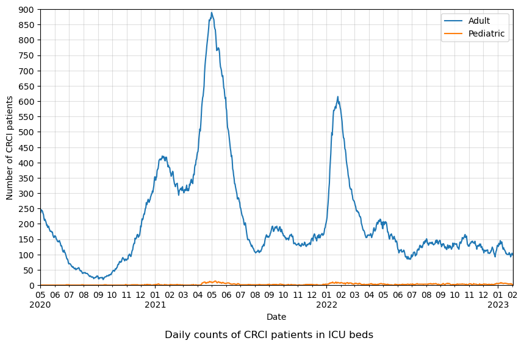

# COVID-19 in Ontario: A Glance from ICUs

Collaborators: Carly Yiao, Helin Kanya, Hardik Gehlot, Mingyao Gu

## Introduction

This project studies COVID-19 in Ontario, Canada from the perspective of ICU occupancy, which is strongly indicative of the seriousness of the pandemic and sheds light on how well Ontario healthcare responds to a pandemic of this scale. The datasets related to ICU occupancy come from Ontario Data Catalogue. The first dataset \[[1](#references)\], with the earliest record dated May 1, 2020 and the latest Feb 2, 2023, compiles daily counts of patients in adult and pediatric ICU beds due to COVID-related critical illness (CRCI) and non-CRCI reasons as well as the number of adult and pediatric ICU beds that are unoccupied. The second dataset \[[2](#references)\], with the earliest record dated April 2, 2020 and the latest Feb 2, 2023, compiles daily snapshots of publicly reported data on COVID-19 testing in Ontario, which includes the number of patients in ICUs due to CRCI by Ontario Health (OH) regions.

## Objectives

Given the scope of the data, this project aims to answer the following questions:
1. What trends about COVID-19 in Ontario do the ICU datasets reveal?
2. What trends can be observed about different Ontario Health regions?
3. What correlations exist for ICU patients of different age groups?
4. Were there enough ICU beds for patients and how well did the hospitals respond to the fluctuating pandemic situation?

## Analyses

The raw data downloaded come in the form of csv files and are stored in the `data` folder. Data wrangling is done with Python and documented in [icu_beds_analysis.ipynb](analysis/icu_beds_analysis.ipynb) and [region_analysis.ipynb](analysis/region_analysis.ipynb). The figures compiled are stored in the `output` folder.

1. What trends about COVID-19 in Ontario do the ICU datasets reveal?

- plot description
    - The line plots chart the daily counts of CRCI patients in ICUs from 2020-05 to 2023-02.
- plot features
    - The blue line represents adult patients and the orange line pediatric patients.
- observations
    - There are far fewer pediatic patients compared to adults.
    - The most prominent surges in the counts of adult patients correspond to the major waves of COVID-19, including the spread of Omicron in early 2022.

- The occupancy in the data visualizations shown describes spikes, dips, and steady slopes in the occupancy change over time in Ontario. These spikes correlate to the severity of COVID-19 symptoms and affected people rates in Ontario. The spikes are when stricter laws of social distancing are installed. 

- These spikes correlate when stricter laws of social distancing are implemented. The first wave happened around February 2020 followed by a lockdown in Ontario on March 17, 2020. The second wave started on September 2020 with the second spike in the graph following the second lockdown effective January 14, 2021. The third wave was the highest spike with a variant of Covid in February 2021. And the fourth wave was due to Omicron on Feb 2022. 

- Adults were more prone to critical covid infections which increase over time. We extracted this data from the two lines shown in this graph with pediatrics as the orange line staying at a steady slope and adult ICUs as the blue line constantly spiking. 

- purpose
    - Autocorrelation measures the degree of similiarity between a given time series and a lagged version of itself over successive time intervals. It can also be understood as the tendency of a system to remain in the same state from one observation to the next.
    - In the context of the time series of adult CRCI patients, if it exhibits autocorrelation, the count of patients at one instance of time probabilistically depends on the past daily counts.
    - Such information is useful to ensure preparedness of health care system.
- plot description
    - The figure plots the autocorrelation of adult CRCI patients in ICUs over different time intervals measured in days.
- plot features
    - The blue region denotes the confidence interval (set to 95% by default), outside which the autocorrelation is considered strong if ACF is between 0.7 and 1.
- observations
    - The daily counts of adult CRCI patients displays strong autocorrelation (ACF>0.8) within a time interval of 3 weeks.
    - No seasonality is observed.

2. Do different regions in Ontario follow certain trends or have similarities/differences in data?
- Regions in Ontario show that more ICU beds are being used for the Toronto region on average throughout the timeline. On the other hand, the smallest amount is for the Central region of Ontario. This can be related to the varied population total in each of the 5 regions. Another thing to take into a factor is the density of people within the specific region. For example, Toronto is denser and more people take public transit, walk, or bike to get to their destinations. This means that it is harder to social distance as compared to more dispersed density populations such as East and Central regions of Ontario. 

- The third wave with the highest spike was due to a variant of Covid which is more contagious spreading 50% more in February 2021. This can be one of the reasons why all the regions are so high in patients during that time. 

- If you focus on the yellow line representing the North region, it shows that there was a sudden increase near the beginning of 2022. We could say that those smaller communities were more exposed to covid-19 during that small increment of time. 

- When it comes to the total sum of patients in each region, Central Ontario has the most with 29.4% of the total patients whereas the North region has the least with 4.3%. This is interesting because there are more ICU patients in total for Central Ontario probably due to the population being bigger, but when the population is evened out throughout the regions, Toronto has the highest peaks for ICU patients over time. 

3. Is the occupancy changes the same for adults and underaged people in Ontario?
- plot description
    - This is a scatter plot of the number of adult CRCI patients versus the total number of adult patients in ICUs.
- plot features
    - The time stamps of each pair of data are overlayed on top in accordance with the color bar on the right-hand side.
- observations
    - When the number of CRCI patients exceeds 200, which in reference to the time series of the adult CRCI patients corresponds to the major waves of COVID-19, there is an approximately linear relation between it and the total number of patients.

- plot description
    - Switching attention to the pediatric group, this sactter plot shows the number of non-CRCI patients versus the total number of patients in ICUs.
- plot features
    - The time stamps of each pair of data are overlayed on top in accordance with the color bar on the right-hand side.
- observations
    - Because the number of CRCI patients in ICUs remains low over the period of investigation, there is a strong linear relation between the number of non-CRCI patients and the total number of patients.
    - Alarmingly, there has been a steady increase of late of non-CRCI pediatric patients in ICUs related to acute respiratory illnesses observed in Ontario from September 2022 onward, particularly in young children aged 0–4 years old. The cause is multi-faceted (from Richard's personal experience, provincial shortage of pediatric medication to treat fever).

- In the scatterplot for the “Availability of ICU beds”, we can see that there was never a shortage of available ICU beds for adults. The same cannot be said about pediatric patients. Due to the recent steady increase in non-CRCI pediatric patients in ICUS, there were 9 days last November when there were not enough ICU beds for pediatric patients. In the graph, we can see that at one point the underaged hospital was not equipped properly as seen from the dip below the required ICU beds. 

- Some observations that can be made are that adult ICU occupancies have more spikes than pediatrics and that underaged people for ICU occupancy remained at a relative slope. This means that adult ICUs are better prepared than pediatrics. And there is a vast difference in how COVID-19 affected more adults than underaged people to a more critical health level. The most prominent surges in the counts of adult patients correspond to the major waves of COVID-19, including the spread of Omicron in early 2022. Overall, adult CRCI patients were always above or well above the amount of pediatric CRCI patients.

4. Were there enough ICU beds during peak times and were hospitals equipped enough during the fluctuating pandemic situation?
- In the heatmap graph, we can see that when the number of CRCI patients exceeds 200, which is about the time series of the adult CRCI patients corresponding to the major waves of COVID-19, there is an approximately linear relation between it and the total number of patients.

- In the scatterplot, we can observe that because the number of CRCI patients in ICUs remains low throughout the investigation, there is a strong linear relation between the number of non-CRCI patients and the total number of patients. Alarmingly, there has been a steady increase of late non-CRCI pediatric patients in ICUs related to acute respiratory illnesses observed in Ontario from September 2022 onward, particularly in young children aged 0–4 years old. The cause is multi-faceted (from Richard's personal experience, provincial shortage of pediatric medication to treat fever).

- In the line graph for the number of beds, we can see the number of beds increased as the cases increased during the covid waves which shows us that there was no shortage of beds. 

- In the second line graph, we can see the number of beds needed for pediatric cases stayed low through the covid waves, but the dip in the graph shows the number of beds decreased for the covid related cases.

- There is a large spike in beds for adults than pediatric during the first part of the graph but the second half shows the variation in beds for pediatric cases was high.

- Third graph shows the period of beds added to the hospitals during the covid waves, after the first wave in May 2020, the number of beds added was small but it all changed during the second wave when they added a large number of beds to the hospital but it was after the peak. Beds were removed right after the second wave which gives more availability to the non-covid related cases.

- Down in the graph, we can see they added a large number of beds during the third wave coinciding with the peak moreover after the wave they removed a large number of beds again to support the non-covid related disease moreover during omicron they were no new beds added by the government which shows the common population were more immune to the variant
	
## Conclusions
After conducting this study, we think the following points
- The hospitals across Canada were poorly ready for a large influx of hospitalization. 
- Adult patients were more likely to form complicated covid cases and thus adults had more hospitalization rate.
- Pediatric patients had lower hospitalization rate and thus showing more immunity against covid-19.
- The correlation graph shows the reduction in beds for non-covid-related diseases. 
- the other regions were seen the same spike in cases.

## References

1. https://data.ontario.ca/en/dataset/availability-of-adult-icu-beds-and-occupancy-for-covid-related-critical-illness-crci
2. https://data.ontario.ca/en/dataset/covid-19-cases-in-hospital-and-icu-by-ontario-health-region
3. https://www.ontariohealth.ca/about-us/our-programs/ontario-health-regions
4. https://www.publichealthontario.ca/-/media/Documents/nCoV/phm/2022/11/covid-respiratory-Illnesses-pediatric-populations-fall-2022.pdf?rev=0fd12bb2aaa84145b7470a4492746ab3&sc_lang=en

## Appendices

A timeline of the project, including the tasks carried out and their time stamps, is shown below.

- Feb 2, 2023: brainstorm ideas and set up Github collaboration
- Feb 6, 2023: decide on datasets and objectives for the study
- Feb 12, 2023: finalize results and conclusions
- Feb 13,2023: complete PowerPoint slides and the README file
- Feb 14, 2023: final presentation
