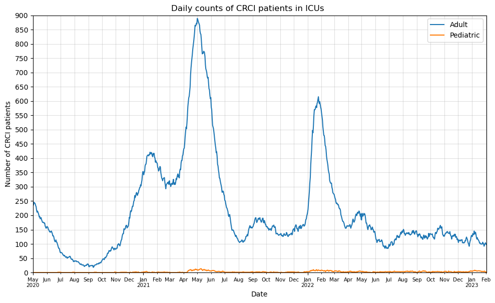
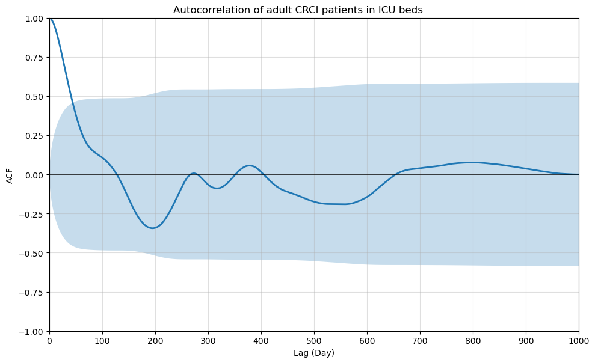
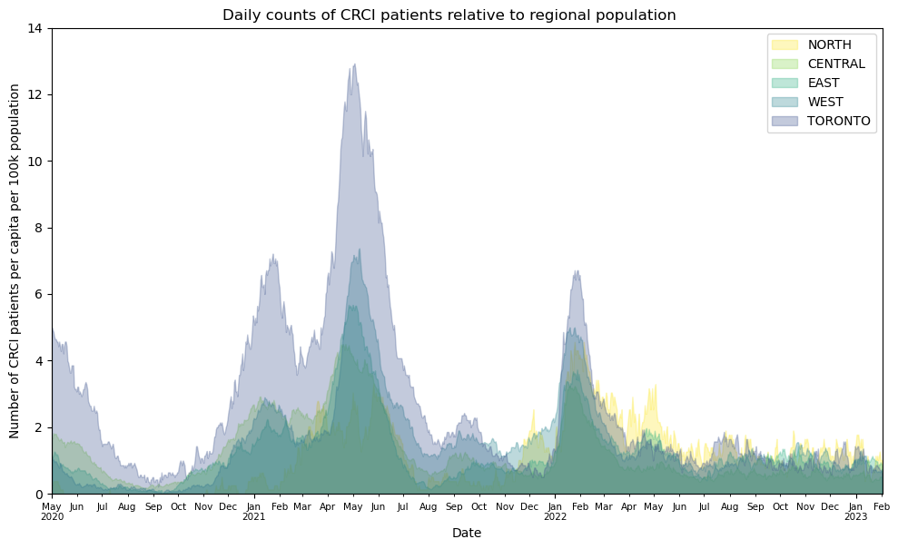
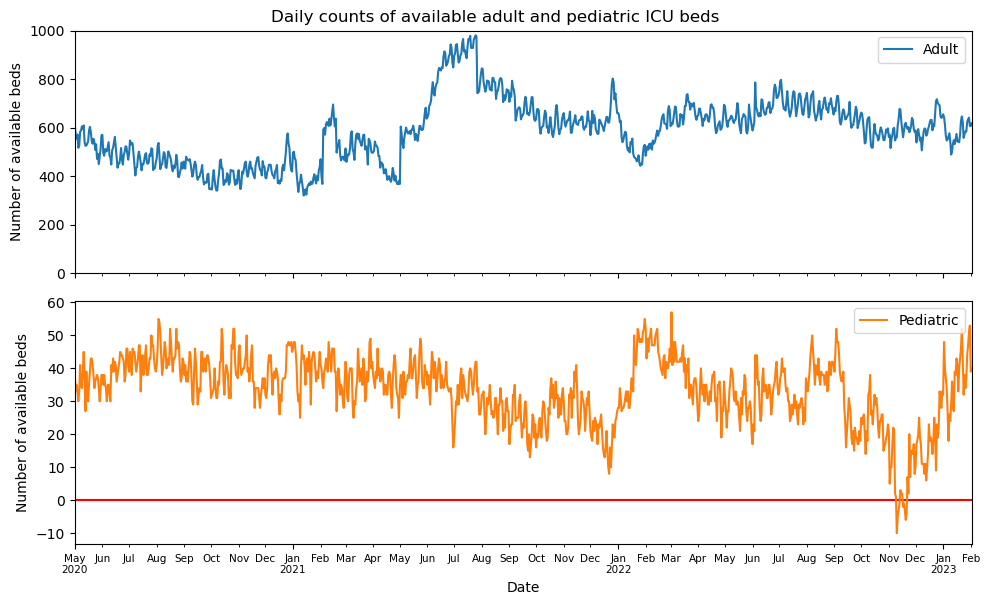
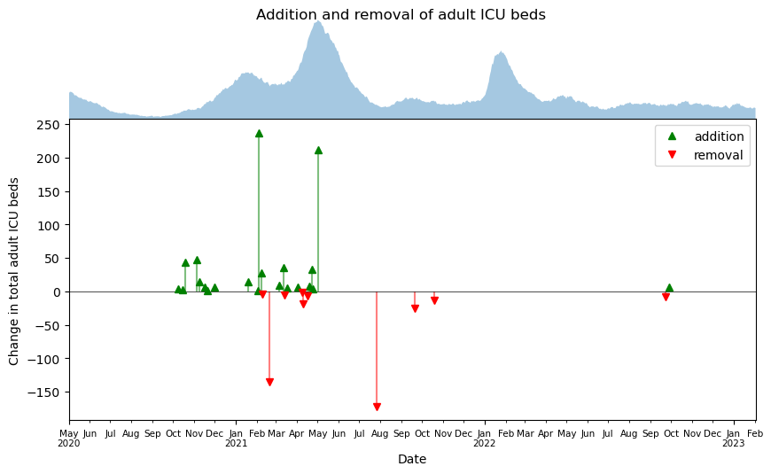

# COVID-19 in Ontario: A Glance from ICUs

Collaborators: Carly Yiao, Helin Kanya, Hardik Gehlot, Mingyao Gu

Latest Update: Feb 14, 2023

## Introduction

This project studies COVID-19 in Ontario, Canada from the perspective of ICU occupancy, which is indicative of the seriousness of the pandemic and sheds light on how well Ontario healthcare responds to a pandemic of this scale. The datasets related to ICU occupancy come from Ontario Data Catalogue. The first dataset \[[1](#references)\], with the earliest record dated May 1, 2020 and the latest Feb 2, 2023, compiles daily counts of patients in adult and pediatric ICU beds due to COVID-related critical illness (CRCI) and non-CRCI reasons as well as the number of adult and pediatric ICU beds that are unoccupied. The second dataset \[[2](#references)\], with the earliest record dated April 2, 2020 and the latest Feb 2, 2023, compiles daily snapshots of publicly reported data on COVID-19 testing in Ontario, which includes the number of patients in ICUs due to CRCI in different Ontario Health (OH) regions.

## Objectives

Given the scope of the data, this project aims to answer the following questions:
1. What trends about COVID-19 in Ontario do the ICU datasets reveal?
2. What similaries/differences do different regions in Ontario show?
3. What correlations exist for ICU patients of different age groups?
4. Were there enough ICU beds for patients and how well did the hospitals respond to the fluctuating pandemic situation?

## Analyses

The raw data downloaded come in the form of csv files and are stored in the `data` folder. Data wrangling and plot configuration are done with Python and documented in [icu_beds_analysis.ipynb](analysis/icu_beds_analysis.ipynb) and [region_analysis.ipynb](analysis/region_analysis.ipynb). The figures compiled are stored in the `output` folder.

1. What trends about COVID-19 in Ontario do the ICU datasets reveal?

- The line plots chart the daily counts of CRCI patients in ICUs from 2020-05 to 2023-02 and show spikes, dips, and steady changes in occupancy at different points of time in Ontario. The blue line represents adult patients and the orange line pediatric patients.
- Adults were much more prone to critical covid infections, as evidenced by the orange line remaining low and steady in contrast with the blue line constantly spiking. 
- The most prominent surges in the counts of adult patients correspond to the major waves of COVID-19 as well as time periods when stricter laws of social distancing were implemented. The first wave happened around Feb 2020 followed by a lockdown effective on Mar 17, 2020. The second wave started around Sep 2020 followed by a lockdown effective Jan 14, 2021. The third wave, as shown by the highest spike in the figure, was a result of the Delta variant in Feb 2021. Lastly, the fourth wave was due to Omicron in Feb 2022.

- The figure plots the autocorrelation of adult CRCI patients in ICUs over different time intervals measured in days.
- Autocorrelation measures the degree of similiarity between a given time series and a lagged version of itself over successive time intervals. In the context of the time series of adult CRCI patients, if it exhibits autocorrelation, the count of patients on one day probabilistically depends on the past daily counts. Such information is useful to ensure preparedness of health care system.
- The blue region denotes the confidence interval (set to 95% by default), outside which the autocorrelation is considered strong and meaningful if the coefficient is between 0.7 and 1; as such, the daily counts of adult CRCI patients display strong autocorrelation (ACF>0.8) within a time interval of 3 weeks.
- No seasonality is immediately evident.

2. What similaries/differences do different regions in Ontario show??

- Similar temporal trends in ICU occupency due to CRCI can be observed in different OH regions. For exmaples, all regions witnessed the highest spikes in patients during the third wave of COVID-19 around Feb 2021, due to Delta being a more contagious variant \[[3](#references)\].
- Interestingly, more ICU beds were occupied in Toronto relative to its population over the time period investigated. The scaling of the number of CRCI patients by the regional population reveals that population density plays an important role in the spreading of the pandemic. For instance, in Toronto, more people take public transit, walk, or bike to reach their destinations, making it more challenging to social distance in comparison with areas with more dispersed populations such as East and Central regions of Ontario.
- Moreover, a comparison of the sum of patients in each region over time shows that Central leads with 29.4% of the grand total and North has the least with 4.3%. This can be related to the former having the largest total population and the latter the lowest \[[4](#references)\]. 
- The line plot for North shows that there was a sudden increase near the beginning of 2022. This could be a result of lack of vaccination coverage, but it warrants further investigation in the future. 

3. What correlations exist for ICU patients of different age groups?

- The [correlation matrix](output/correlation_matrix.png) for the ICU beds occupancy dataset shows strong correlations between some features of the dataset, two of which are highlighted here as follows:

- The scatter plot shows the total number of adult patients in ICUs versus the number of adult CRCI patients, with the time stamps of each pair of data overlayed on top in accordance with the color bar on the right-hand side.
- When the number of CRCI patients exceeds 200, which in reference to the time series of the adult CRCI patients corresponds to the major waves of COVID-19, there is an approximately linear relation between total and CRCI patients.

- Switching attention to the pediatric patients, this sactter plot shows the total number versus non-CRCI patients in ICUs. The temporal information on each pair of data is overlayed on top in accordance with the color bar on the right-hand side.
- Because the number of CRCI patients in ICUs remained low over the period of investigation, there exists a nearly perfect linear relation between the total number of patients and the number of non-CRCI patients.
- Alarmingly, there has been a steady increase of late of non-CRCI pediatric patients in ICUs related to acute respiratory illnesses observed in Ontario from Sep 2022 onward, particularly in young children aged 0 to 4 years old. The cause is multi-faceted (e.g. from one of the collaborator's personal experience, provincial shortage of pediatric medication to treat fever).

4. Were there enough ICU beds for patients and how well did the hospitals respond to the fluctuating pandemic situation?

- The line plots record the daily counts of available (i.e. unoccupied) beds in ICUs from 2020-05 to 2023-02. The blue line represents the beds available for adult patients and the orange line those available for pediatric patients.
- The blue line is shown to always stay in the range of positive hundreds, indicating that there was never any shortage of available ICU beds for adults. There was in fact a steady increase in the number of available beds between May and Aug 2021 (to be explained shortly).
- By contrast, the number of available beds for pediatric patients remained relatively low and surprisingly dropped below zero for 9 days in Nov 2022, as evidenced by the orange line crossing the red horizonal line at zero. It is tied to the recent steady increase in non-CRCI pediatric patients in ICUs (demonstrated in the answers to Question 3), for which the ICUs were ill-prepared. 

- The figure shows the time stamps when the adult ICU beds were added (green) or removed (red). It is generated by subtracting from the total number of beds on a given day its counterpart from the previous day. The daily counts of CRCI patients in ICUs are added to help visualize the addtions and removals of beds in response to the waves of COVID-19.
- The largest daily addition of adult ICU beds occurred after the number of patients peaked during the second wave of COVID-19 and the second largest daily addition coincided with the peak during the Delta wave. Moreover, no bed was added during Omicron.
- The addition of beds in May 2021 and the subsequent removal in August 2021, accompanied by a steady decrease in the adult CRCI cases, resulted in the aforemnetioned increase in the number of available beds during this period.
	
## Conclusions

The history of COVID-19 in Ontario, including many of its waves, is mirrored in the ICU occupancy datasets. Adults were more prone to complicated COVID cases and had more ICU admissions than younger patients. While there was consistently a surplus of beds for adults, the ICUs were not always prepared for pediatric patients, especially during Nov 2022 when there was a signficant rise in non-CRCI cases. Moreover, population density played an impactful role in the spreading of the pandemic, resulting in Toronto leading in the number of CRCI patients admiited to ICUs relative to its regional population.

While the datasets provide strong insight into the COVID pandemic in Ontario, further study can be carried out in investigating the role of vaccination coverage at different points of time. More in-depth time series analysis can be carried as well to reveal potential trends and seasonality to help health care services become more equipped and prepared.

## References

1. https://data.ontario.ca/en/dataset/availability-of-adult-icu-beds-and-occupancy-for-covid-related-critical-illness-crci
2. https://data.ontario.ca/en/dataset/covid-19-cases-in-hospital-and-icu-by-ontario-health-region
3. https://www.publichealthontario.ca/-/media/documents/ncov/voc/2021/08/covid-19-delta-variant-risk-assessment-implications.pdf?sc_lang=en#:~:text=Data%20from%20India%2C%20the%20UK,Delta%20are%20higher%20than%20Alpha
4. https://www.ontariohealth.ca/about-us/our-programs/ontario-health-regions
5. https://www.publichealthontario.ca/-/media/Documents/nCoV/phm/2022/11/covid-respiratory-Illnesses-pediatric-populations-fall-2022.pdf?rev=0fd12bb2aaa84145b7470a4492746ab3&sc_lang=en

## Appendices

A timeline of the project, including the tasks carried out and their time stamps, is shown below.

- Feb 2, 2023: brainstorm ideas and set up Github collaboration
- Feb 6, 2023: decide on datasets and objectives for the study
- Feb 12, 2023: finalize results and conclusions
- Feb 13,2023: complete PowerPoint slides and the README file
- Feb 14, 2023: final presentation
